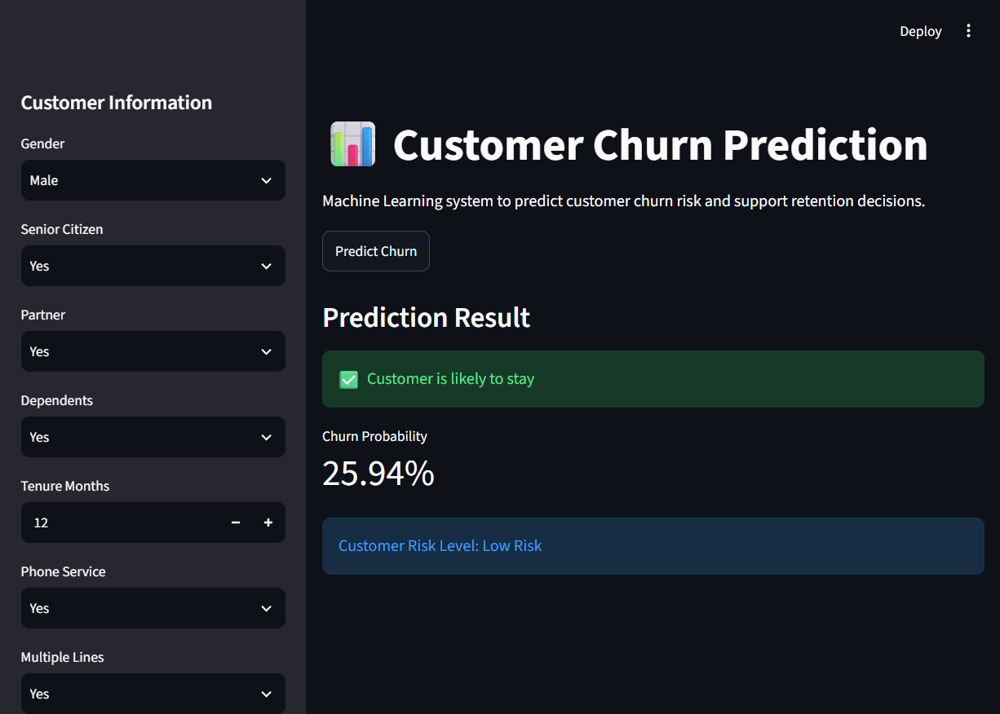

# 📊 Smart Customer Retention & Revenue Optimization Platform


---

## 📖 Overview

Customer churn is one of the biggest challenges facing subscription-based businesses. Losing existing customers directly impacts revenue, increases acquisition costs, and reduces customer lifetime value.

This project develops an **End-to-End Machine Learning solution** that predicts whether a customer is likely to churn based on demographic information, subscribed services, contract details, and billing history.

The solution enables businesses to identify high-risk customers early and take proactive retention actions.

---

## 🎯 Business Problem

Retaining existing customers is significantly more cost-effective than acquiring new ones.

Without an intelligent prediction system, companies typically react only after customers have already left.

This platform helps businesses:

- Predict customer churn.
- Prioritize retention campaigns.
- Reduce revenue loss.
- Improve customer satisfaction.
- Support data-driven business decisions.

---

## 📂 Dataset

The dataset contains **7,000+ customer records** including:

- Customer demographics
- Service subscriptions
- Internet services
- Contract information
- Billing information
- Payment methods
- Customer tenure
- Monthly charges
- Total charges

**Target Variable**

```
Churn Value
```

---

## 🚀 Project Pipeline

```
Business Understanding
        │
        ▼
Data Cleaning
        │
        ▼
Exploratory Data Analysis
        │
        ▼
Feature Engineering
        │
        ▼
Data Preprocessing
        │
        ▼
Model Training
        │
        ▼
Hyperparameter Tuning
        │
        ▼
Threshold Optimization
        │
        ▼
Streamlit Deployment
```

---

## 📊 Exploratory Data Analysis

The EDA focused on identifying business insights and churn patterns through visual analysis.

The analysis included:

- Gender Distribution
- Senior Citizens
- Partner Status
- Dependents
- Customer Tenure
- Internet Service
- Contract Type
- Payment Method
- Monthly Charges
- Total Charges

Each visualization was accompanied by business-oriented insights.

---

## 🤖 Machine Learning Models

The following algorithms were trained and evaluated:

- Logistic Regression
- Decision Tree
- Random Forest
- Gradient Boosting
- XGBoost
- LightGBM
- CatBoost

The best-performing model was selected after comparing multiple evaluation metrics and optimizing the classification threshold.

---

## 📈 Evaluation Metrics

Models were evaluated using:

- Accuracy
- Precision
- Recall
- F1 Score
- ROC AUC

Threshold optimization was also performed to improve customer retention performance beyond the default probability threshold.

---

## 💻 Streamlit Application

The deployed application allows users to:

- Enter customer information
- Predict churn probability
- Display churn risk
- Support customer retention decisions

---

## 📁 Project Structure

```
Smart Customer Retention & Revenue Optimization Platform
│
├── data
│   ├── raw
│   ├── processed
│
├── notebooks
│   ├── 01_Data_Understanding.ipynb
│   ├── 02_Data_Cleaning.ipynb
│   ├── 03_Exploratory_Data_Analysis.ipynb
│   ├── 04_Feature_Engineering.ipynb
│   ├── 05_Model_Training.ipynb
│   ├── 06_Model_Tuning.ipynb
│
├── models
│   ├── final_model.pkl
│   └── preprocessor.pkl
│
├── app.py
├── requirements.txt
└── README.md
```

---

## ⚙️ Installation

Clone the repository

```bash
git clone https://github.com/yourusername/Smart-Customer-Retention.git
```

Move to the project folder

```bash
cd Smart-Customer-Retention
```

Install dependencies

```bash
pip install -r requirements.txt
```

---

## ▶️ Run the Application

```bash
streamlit run app.py
```

---

## 🛠️ Technologies

- Python
- Pandas
- NumPy
- Scikit-learn
- Matplotlib
- Seaborn
- XGBoost
- LightGBM
- CatBoost
- Streamlit
- Joblib

---

## 🔮 Future Improvements

- SHAP Explainability
- Customer Segmentation
- Real-time Prediction API
- Cloud Deployment
- Automated Model Retraining
- Dashboard with Business KPIs

---

## 📸 Project Preview

### Streamlit App

<p align="center">

</p>

## 👨‍💻 Author

**Mostafa Atia**

AI Engineer | Machine Learning Engineer | Data Scientist

LinkedIn: *(https://www.linkedin.com/in/mostafa-attia-971040370/)*

GitHub: *(https://github.com/MostafaAttia-creator)*